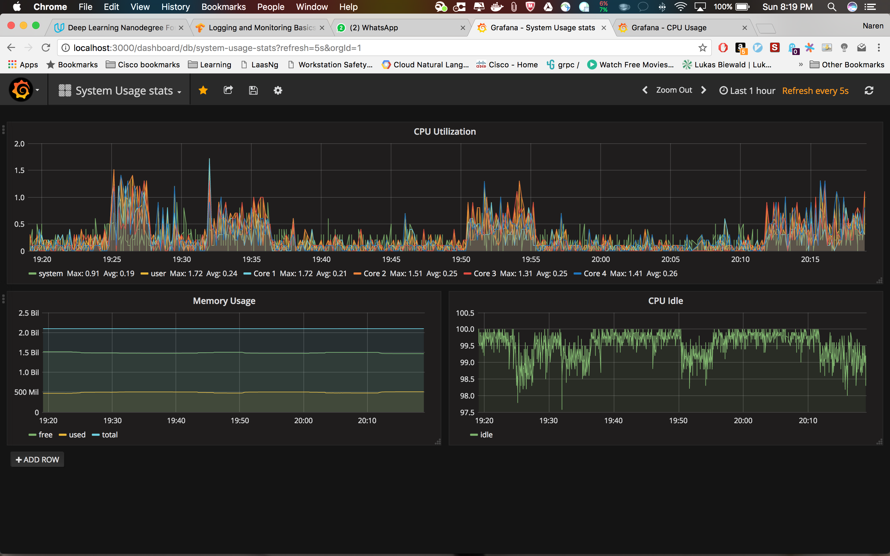

[](https://travis-ci.org/naren-m/System-usage-monitor)
# Influxdata getting started with dockers

## Getting started
1. Clone this repo
1. Get into `System-usge-monitor` folder
1. Run docker-compose command

```s
$ docker-compose up -d
```

> Create a docker network named "infuxdb"

docker-compose builds the entire Grafana and Influx stack.

The Grafana Dashboard is now accessible via: http://<Host IP Address>:3001 for example http://localhost:3001

For [grafana](https://github.com/grafana/grafana-docker) user name and password are admin/admin

## Sample dashboard




## Trigger alert from Stream data using Tickscripts and Templates

After starting all the dockers, get on to the kapacitor docker using below command.

```s
docker exec -it kapacitor bash -l
```

Get into the tickscripts/templates directory then define and run the tickscripts/templates.


1.[TickScripts](https://github.com/naren-m/influxdb_get_started/tree/master/tickscripts)

2.[Templates](https://github.com/naren-m/influxdb_get_started/tree/master/templates)


## Checking logs

```shell
docker logs -f influxdb
docker logs -f telegraf
docker logs -f kapacitor

```

## Creating Config file

InfluxDB

```s
docker run --rm influxdb incluxd config > influxdb.conf
```

Kapacitor

```s
docker run --rm kapacitor kapacitord config > kapacitor.conf
```

Telegraf

```s
docker run --rm telegraf -sample-config -input-filter cpu:mem -output-filter influxdb > telegraf.conf
```

## References

1.[Kapacitor geting startedguide](https://docs.influxdata.com/kapacitor/v1.2/introduction/getting_started/)

2.[Kapacitpor API Documentation](https://docs.influxdata.com/kapacitor/v1.2/api/api)

3.[Kapacitor Templating Documentation](https://docs.influxdata.com/kapacitor/v1.2/examples/template_tasks/)
